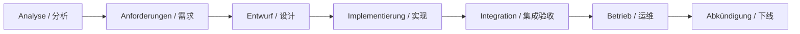

# PROJEKT — 课程要求（德文原文 + 中文对照）

> **Quelle / 来源**：Web-Technologies I 理论阶段课程方说明  
> **Abgleich / 项目对照**：[`答辩清单.md`](./答辩清单.md)、[`PROJEKT_ANFORDERUNGEN_ZH.md`](./PROJEKT_ANFORDERUNGEN_ZH.md)（同内容索引）

> **课程符合性（一句话）**：Anitrack 在代码与仓库层面已满足课程全部**内容要求**（NestJS、全栈 Web、API-first、CRUD、MongoDB、集成/单元测试、业务逻辑在后端、响应式 UI）；**组织要求**（三人各约 7 分钟、分工说明、Präsentation + Live-Demo）需在答辩现场完成，见 [`答辩清单.md`](./答辩清单.md)。  
> **Compliance (one line)**：All **content** requirements are implemented in the repo; **organizational** requirements are met at presentation time.

---

## PROJEKT ORGANISATORISCH / 组织要求

| Deutsch | 中文 |
|---------|------|
| **3er-Gruppen** | **三人小组** |
| **Präsentation und Live-Demo** am Ende der Theoriephase | 理论阶段结束时：**汇报 + 现场演示** |
| **Ca. 7 Minuten pro Person** | 每人约 **7 分钟** |
| Alle Gruppenmitglieder sollten einen **etwa gleichen Redeanteil** haben. | 组员发言时间 **大致相当** |
| **Erklären, wer im Projekt für welche Teile verantwortlich ist.** | 说明 **谁负责哪一部分** |

### Framework-Wahl / 后端框架（二选一）

| Deutsch | 中文 |
|---------|------|
| Backend mit Framework, um Routineaufgaben und Boilerplate zu sparen | 用框架减少样板代码与常规重复实现 |
| **Flask** (Python) — https://flask.palletsprojects.com/en/stable/ | 课程选项之一 |
| **NestJS** (JavaScript/TypeScript) — https://nestjs.com/ | 课程选项之一 |

**Anitrack / 本项目**：**NestJS** → `anitrack/anitrack-backend/`

---

## PROJEKT INHALTLICH / 内容要求

| Deutsch | 中文 |
|---------|------|
| Webapplikation mit **Backend**, **Frontend**, **HTTP-API** | 含后端、前端、HTTP API 的 Web 应用 |
| Backend: **Business-Logik** + **(einfache) Datenhaltung** | 后端：业务逻辑 +（简单）数据 persistence |
| HTTP-API nach **CRUD** als Schnittstelle zur Business-Logik | HTTP API 提供 CRUD，连接业务逻辑 |
| Entwicklung nach **„API first“** | **API 优先**：先定 API 契约 |
| API funktioniert mit **Frontend** und **Script-Clients** | API 可供前端与脚本客户端使用 |
| **Integrationstests** für die API | API **集成测试** |
| **Unittests** für Business-Logik (ggf.) | 业务逻辑 **单元测试**（建议有） |
| Frontend: **keine oder nur wenig** Business-Logik | 前端 **少做/不做** 业务逻辑 |
| **Responsive Design** — Mobil + Desktop | **响应式**：手机与桌面可用 |

---

## ANFORDERUNGEN / 需求分类（术语）

| Deutsch | 中文 | Anitrack 举例 |
|---------|------|----------------|
| **Funktionale Anforderungen** | **功能需求** — 系统要提供什么功能 | 清单 CRUD、时间表、热力图、当季推荐 |
| **Nicht-funktionale / Qualitätsanforderungen** | **非功能 / 质量需求** | 正确性（409 状态机）、可用性（i18n）、可靠性（Bee 退避） |
| **Randbedingungen** | **约束条件** | NestJS、MongoDB Atlas、Jikan 限流、单用户 |

### Software-Lebenszyklus / 软件生命周期

| DE | ZH |
|----|-----|
| Analyse → Anforderungen → Entwurf → Implementierung → Integration/Abnahme → Betrieb/Wartung → Abkündigung | 分析 → 需求 → 设计 → 实现 → 集成/验收 → 运维 → 下线 |

---

## Kurzverweis Anitrack / 项目速查

| Kurspunkt / 课程点 | Im Projekt / 项目中 |
|--------------------|---------------------|
| NestJS | `anitrack-backend/` |
| API first + CRUD | `swagger.json`, `/api/anime`, `/api-docs` |
| Integrationstests | Jest e2e/smoke, Vitest integration, contract-validator |
| Unittests | `heatmap-calc`, Jest |
| Wenig Logik im Frontend | Stats、Heatmap、Bee 在后端 |
| Responsive | `TASK_PROGRESS.md` §4.11 |
| Diagramme | `anitrack-visuals/figures/`（投屏英文） |
